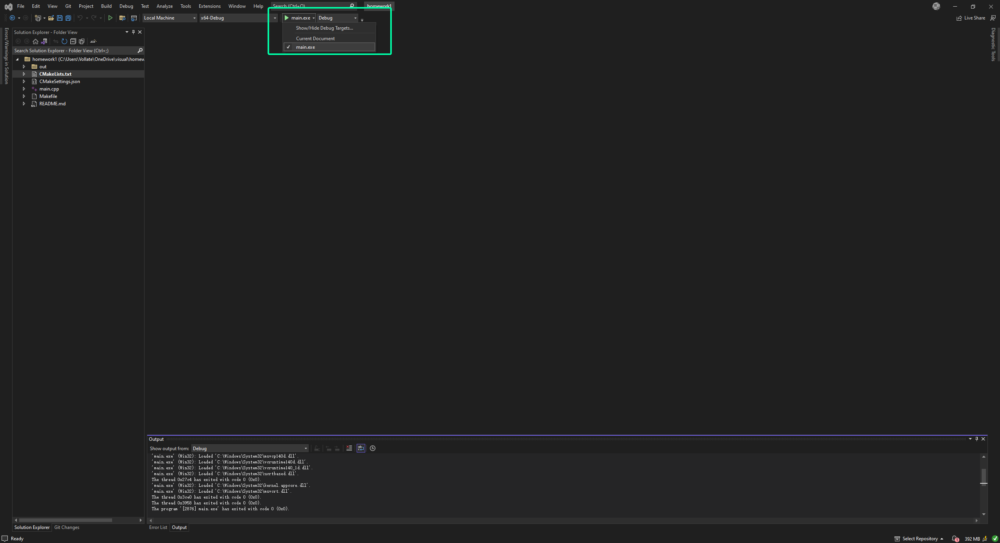

# 小练习

将`c_str`中的字符串逆序输出到`res_str`中

- Input: string with length less than 100
- Output: reverse string

## How to run

### Windows

用VS打开当前文件夹，然后设置target，运行即可

Clion用户google如何运行cmake项目

### Linux

- run `make` to compile
- run `make test` to test your code

